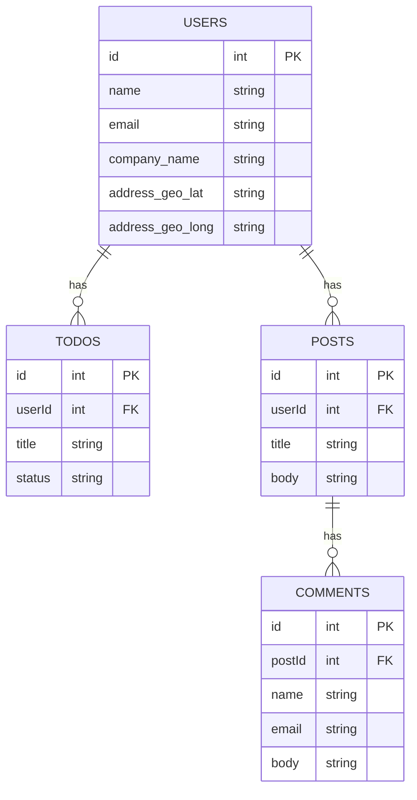

# NodeJS Assignment

Write node-js code server that:
1. Has a single GET endpoint: <http://localhost:[port]/get_data?company=companySearchStr>
      companySearchStr is free user search string, if companySearchStr not supplied, return ALL results, and returns a JSON with the following results:
   1. Distinct company names (name only) of all users that have more than 3 distinct completed tasks.
   2. Only return company names that contain "companySearchStr " case-insensitive.
   3. Users names & emails that:
       1.	Have more than 2 posts with more than 3 comments.
       2.	Have geo locations (both "lat" and "long" fields) filled.
   4. For each user return the number of "todo" items.
2. Use https://jsonplaceholder.typicode.com dummy API  service (in your node-js code) for retrieving all data as needed above.
3. Write code only in TypeScript.
4. Write typed and efficient code.
5. Write 3 different basic unit tests above (bonus).
6. Prepare simple docker file with node-js configuration (bonus).
7. Suggest some cache mechanism to reduce API queries done by node-js server to "jsonplaceholder" server (only suggest, coding it is bonus but not required).

Good Luck and have fun!

### Notes
#### Response Schema
```
[
    {
        "name": "Sony",
        "users":
        [
            {
                "name": "John Doe",
                "email": "jdoe@sony.com"
                "todoCount": 3
            }
        ]
    }
]
```

#### Data Relations

